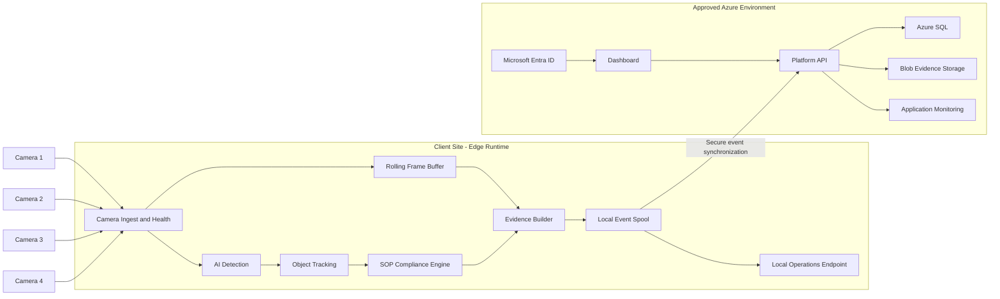

# Solution Architecture

## Architecture decision

The MVP uses a **hybrid edge/Azure architecture**. Video ingestion, AI inference, SOP evaluation, and evidence creation run at the client site. Azure hosts only the application services approved by the client and receives event metadata and evidence rather than continuous raw camera streams.

This preserves low latency and operational continuity while aligning the management layer with the client's Microsoft and Azure environment.

## Logical architecture

## Edge responsibilities

- camera configuration and RTSP connectivity;
- reconnect and stream-health handling;
- frame sampling and timestamp normalization;
- bale and worker inference;
- camera-local tracking;
- inspection-zone and SOP state evaluation;
- pre-event and post-event frame buffering;
- snapshot and short clip creation;
- local event persistence during connectivity loss;
- secure synchronization and duplicate prevention;
- service watchdog and operational logs.

## Azure responsibilities

- authenticated dashboard access;
- event metadata and evidence management;
- search, filters, event review, and remarks;
- CSV/PDF export;
- audit logs and application monitoring;
- approved retention policies;
- deployment of API and web application through GitHub Actions.

## Data-flow sequence

1. A camera provides an RTSP stream to the edge workstation.
2. The ingest service validates stream health and samples frames.
3. The AI service detects and tracks bales and workers.
4. Zone logic and the SOP state machine evaluate the interaction sequence.
5. A normal or violation event is created with a reason code and confidence metadata.
6. The rolling buffer produces a snapshot and short evidence clip.
7. The event is written to the local spool.
8. The sync process sends metadata and approved evidence to the application API.
9. The dashboard receives near-real-time updates and allows review.

## Failure behavior

### Camera unavailable

- mark the camera offline;
- retry with controlled backoff;
- record health events;
- do not classify absent footage as an inspection violation.

### Internet unavailable

- continue local camera processing;
- retain events in the local spool;
- synchronize after connectivity returns;
- use deterministic event IDs to prevent duplicates.

### Azure unavailable

- continue edge processing and local persistence;
- expose local operational status where approved;
- retry synchronization without losing ordered event records.

### Edge service failure

- run services under a managed Windows service or approved container runtime;
- use watchdog restart and structured logs;
- recover pending events from persistent storage.

## Deployment environments

- **Local development:** simulated streams and sample events only.
- **Integration:** controlled test cameras or approved recorded footage.
- **Azure non-production:** API, dashboard, database, and storage for integration/UAT.
- **Production edge:** client-site GPU workstation and cameras.
- **Production Azure:** client-approved tenant and subscription resources.

## Architecture constraints

- no credentials or camera URLs in source control;
- no continuous raw-video upload by default;
- no permanent bale identity without an external identifier;
- no face recognition;
- final Azure networking and identity design depends on the client tenant and security approvals;
- final camera fields of view depend on the site survey.
