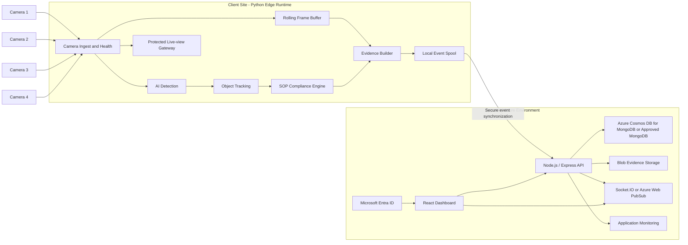

# Solution Architecture

## Architecture decision

The MVP uses a **hybrid edge/Azure architecture**. Video ingestion, AI inference, SOP evaluation, and evidence creation run at the client site. Azure hosts only the application services approved by the client and receives event metadata and evidence rather than continuous raw camera streams.

The application layer uses the team's preferred **MERN + Python** stack while remaining aligned with the client's Microsoft identity and Azure hosting environment.

## Logical architecture

## Edge responsibilities

- camera configuration and RTSP connectivity;
- reconnect and stream-health handling;
- frame sampling and timestamp normalization;
- bale and worker inference;
- camera-local tracking;
- inspection-zone and SOP state evaluation;
- pre-event and post-event frame buffering;
- snapshot and short clip creation;
- local event persistence during connectivity loss;
- secure synchronization and duplicate prevention;
- protected browser-compatible live-view delivery;
- service watchdog and operational logs.

## Azure/application responsibilities

- React dashboard authenticated through Microsoft Entra ID;
- Node.js/Express event and health ingestion APIs;
- MongoDB-compatible event metadata, review, audit, and health records;
- private snapshot and short-clip storage in Azure Blob Storage;
- event search, filters, review status, and remarks;
- CSV/PDF export;
- near-real-time event and health updates;
- audit logs and application monitoring;
- approved retention policies;
- deployment through GitHub Actions and Bicep.

## Data-flow sequence

1. A camera provides an RTSP stream to the edge workstation.
2. The Python ingest service validates stream health and samples frames.
3. The AI service detects and tracks bales and workers.
4. Zone logic and the SOP state machine evaluate the interaction sequence.
5. A completed, missed, incomplete, or unresolved event is created with a reason code and confidence metadata.
6. The rolling buffer produces a snapshot and short evidence clip.
7. The event is written to the durable local spool.
8. The synchronization service submits metadata to the Node.js API and uploads approved evidence.
9. The API persists metadata in the approved MongoDB-compatible database and evidence in Blob Storage.
10. The React dashboard receives near-real-time updates and allows authorized review.

## Failure behavior

### Camera unavailable

- mark the camera offline;
- retry with controlled backoff;
- record health events;
- do not classify absent footage as an inspection violation.

### Internet unavailable

- continue local camera processing;
- retain events in the local spool;
- synchronize after connectivity returns;
- use deterministic event IDs to prevent duplicates.

### Azure/API unavailable

- continue edge processing and local persistence;
- expose local operational status where approved;
- retry synchronization without losing ordered event records.

### Edge service failure

- run Python components as managed Windows services or through an approved container runtime;
- use watchdog restart and structured logs;
- recover pending events from persistent storage.

## Deployment environments

- **Local development:** simulated streams and sample events only.
- **Integration:** controlled test cameras or approved recorded footage.
- **Azure non-production:** React dashboard, Node.js API, MongoDB-compatible database, Blob Storage, and identity integration for integration/UAT.
- **Production edge:** client-site GPU workstation and four cameras.
- **Production Azure:** client-approved tenant and subscription resources.

## Architecture constraints

- no credentials or camera URLs in source control;
- no continuous raw-video upload by default;
- no permanent bale identity without an external identifier;
- no face recognition;
- no direct browser access to camera RTSP credentials;
- final Azure networking, MongoDB service selection, and identity design depend on client approvals;
- final camera fields of view depend on the site survey.
