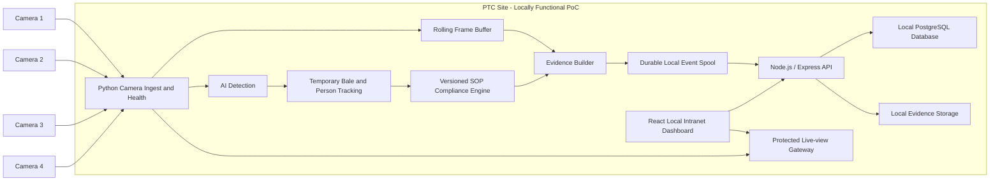
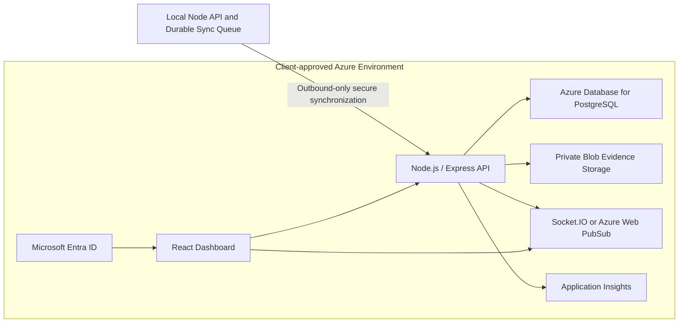

# Solution Architecture

## Architecture decision

The PoC is **local-first and Azure-aligned**.

The awarded BOQ requires offline AI inference, local event/database storage, and a local intranet dashboard. Therefore the complete core inspection workflow must operate at the client site without internet access. Microsoft Azure may host approved management-plane services, remote access, identity, monitoring, or synchronized evidence, but those services must not become a hidden dependency for core PoC operation.

The application layer uses React/TypeScript, Node.js/Express, PostgreSQL/Prisma and Python. The Node.js API, PostgreSQL database, React dashboard and Python services can all run locally on the supplied workstation. The same API and dashboard can later use an approved Azure Database for PostgreSQL instance where issue #11 confirms a managed central deployment.

## Required local PoC architecture

This local topology is the minimum operational baseline for the PoC. PostgreSQL is self-hosted on the workstation through the approved local container/service configuration and does not require a paid external database.

## Optional approved Azure management plane

When the client approves Azure use, the local system may synchronize approved event metadata and evidence to Azure.

The exact Azure resources, data synchronization policy, identity flow, and dashboard location remain pending under issue #11. The PoC must not implement duplicated local/cloud infrastructure that the client has not approved.

## Edge and local responsibilities

- camera configuration and RTSP connectivity;
- reconnect and stream-health handling;
- frame sampling, rotation, and timestamp normalization;
- bale and anonymous worker inference;
- camera/zone-local temporary tracking;
- inspection-zone and SOP state evaluation;
- completed, missed, incomplete, unresolved, and health outcomes;
- pre-event and post-event frame buffering;
- snapshot and short clip creation;
- local PostgreSQL event, review, health and audit records;
- protected local evidence files;
- local browser dashboard and review workflow;
- durable persistence during internet or Azure outage;
- optional secure synchronization and duplicate prevention;
- protected browser-compatible live-view delivery;
- service watchdog and operational logs;
- database migrations, backups and restores.

## Approved Azure responsibilities, where enabled

- Microsoft Entra ID authentication for remote/central users;
- synchronized event and health ingestion;
- PostgreSQL event, review, audit, configuration, and health records;
- private snapshot and short-clip storage in Azure Blob Storage;
- remote event search, filters, review status, and remarks;
- on-demand CSV/PDF export;
- near-real-time synchronized event and health updates;
- application monitoring and approved retention policies;
- deployment through GitHub Actions and Bicep.

## Data-flow sequence

1. A camera provides an RTSP stream to the site workstation.
2. The Python ingest service validates stream health, orientation, timestamps, and sampling.
3. The AI service detects bales and anonymous workers.
4. Temporary camera/zone tracks create an inspection session.
5. Zone logic and the SOP state machine evaluate the approved opening/frisking sequence.
6. A completed, missed, incomplete, or unresolved event is created with a reason code and confidence metadata.
7. The rolling buffer produces a snapshot and short evidence clip.
8. The event is persisted locally through the Node.js API into PostgreSQL, while evidence is stored in the protected local evidence area.
9. The local React dashboard displays the event and supports review without internet access.
10. Where Azure synchronization is approved, the durable sync process submits metadata and approved evidence using stable IDs and checksums.

## PostgreSQL data principles

- normalized relational tables are used for users, sessions, cameras, events, ordered SOP steps, evidence metadata, health and audit logs;
- foreign keys protect relationships;
- transactions keep review mutation and audit creation atomic;
- event version numbers implement optimistic concurrency;
- compound indexes support time, camera, outcome and review filters;
- UTC timestamps are stored in PostgreSQL;
- `JSONB` is used only for approved flexible AI/configuration payloads that do not justify a dedicated relational structure;
- Prisma migrations are reviewed and committed;
- production/shared environments use `prisma migrate deploy`;
- local backup and restore use `pg_dump` and `pg_restore`.

## Reference-project boundary

The Bangladesh reference supports the physical and iterative PoC approach but does not define the PTC architecture. In particular:

- the visible `Not Scanned` state must not be treated as opening/frisking until confirmed;
- overhead camera placement is a site-survey hypothesis;
- no permanent bale identity is demonstrated;
- the generic people-tracking demo does not add worker identity, dwell analytics, or item counting;
- PTC site footage is required for final training and acceptance.

See `docs/20-bangladesh-reference-poc-analysis.md`.

## Failure behavior

### Camera unavailable

- mark the camera offline;
- retry with controlled backoff;
- record health events;
- do not classify absent footage as an inspection violation.

### Internet or Azure unavailable

- continue camera processing, local event creation, PostgreSQL persistence, evidence, and local dashboard access;
- retain unsynchronized records in the durable local queue;
- synchronize after connectivity returns;
- use deterministic event IDs and checksums to prevent duplicates.

### Local application unavailable

- preserve pending AI events in the durable spool;
- restart the affected Node/Python service through the watchdog;
- restore local dashboard/API service;
- replay pending records idempotently.

### PostgreSQL unavailable

- API readiness returns unavailable;
- Python edge services retain pending events in the durable local spool;
- restart PostgreSQL through the approved service/container manager;
- verify volume integrity and available disk space;
- restore from the latest approved backup if recovery is required;
- replay pending events only after database readiness is restored.

### Edge service failure

- run Python and Node components as managed Windows services or through an approved container runtime;
- use watchdog restart and structured logs;
- recover pending events from persistent storage.

## Deployment environments

- **Local development:** simulated streams and non-sensitive sample events using a dedicated PostgreSQL database.
- **Integration:** controlled test cameras or approved recorded footage.
- **Site UAT:** full local PoC stack on the approved workstation and four cameras.
- **Azure non-production:** only after client approval, for synchronized application integration/UAT.
- **Production PoC:** approved local stack, with approved Azure components where applicable.

## Architecture constraints

- core PoC operation and local review cannot depend on internet availability;
- no credentials, database URLs or camera URLs in source control;
- no continuous raw-video upload by default;
- no permanent bale identity without an external identifier;
- no face recognition or worker identification;
- no direct browser access to camera RTSP credentials;
- no scanner, RFID, custom IoT, or PLC integration without change approval;
- final Azure networking, managed PostgreSQL selection, and identity design depend on client approval;
- final camera fields of view depend on the PTC site survey, not the Bangladesh reference alone.
