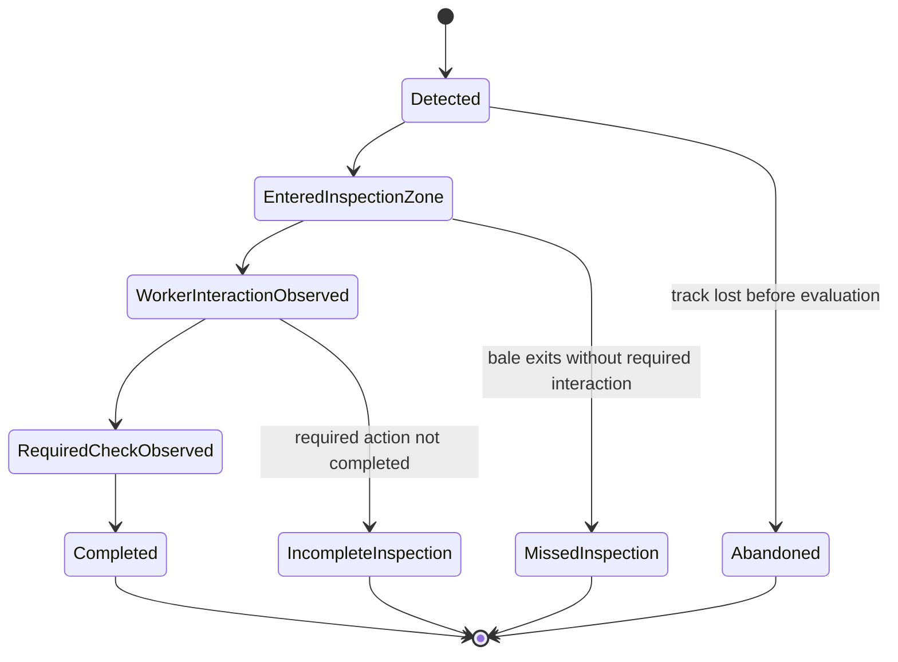

# SOP and Domain Model

## Purpose

The AI system must evaluate a client-approved operational sequence. It must not infer business rules from visual patterns alone. The final SOP, valid exceptions, and violation definitions require written client approval before model acceptance.

## Core domain entities

### Camera

Represents one configured inspection-area camera.

- camera ID;
- display name and physical zone;
- stream configuration reference;
- health status;
- last-frame timestamp;
- active zone configuration version.

### Bale track

A temporary computer-vision track visible within one camera sequence.

- camera-local track ID;
- first-seen and last-seen timestamps;
- entry, inspection, and exit-zone timestamps;
- associated worker tracks;
- confidence history.

A bale track is not a permanent business identifier.

### Worker track

A temporary person track used only to evaluate interaction with a bale and inspection zone. No face recognition, identity, biometric profile, or employee scoring is included.

### Inspection session

A derived sequence for one bale track while it moves through the monitored inspection workflow.

- session ID;
- camera ID;
- bale track ID;
- start and end time;
- observed states;
- final outcome;
- reason codes;
- evidence references;
- model, SOP, and configuration versions.

### Event

A normal inspection, violation, or system-health occurrence persisted for dashboard review.

## Proposed state-machine pattern

The state names below are placeholders until the client confirms the SOP.

## Initial event taxonomy

### Compliance events

- `inspection.completed`

### Violation events

- `inspection.missed`
- `inspection.incomplete`

### Operational events

- `camera.offline`
- `camera.recovered`
- `edge.service_degraded`
- `sync.pending`
- `sync.recovered`

Operational failures must not be misclassified as inspection violations.

## Rule inputs

- configured camera and zones;
- bale detection and track confidence;
- worker detection and track confidence;
- spatial association between bale, worker, and inspection zone;
- observed interaction/action signal;
- minimum action duration;
- allowed sequence timing;
- exit condition;
- occlusion and lost-track thresholds.

## Reason codes

Each inspection outcome must contain a machine-readable reason code, for example:

- `NO_WORKER_INTERACTION`
- `CHECK_DURATION_BELOW_THRESHOLD`
- `REQUIRED_ACTION_NOT_OBSERVED`
- `BALE_EXITED_BEFORE_CHECK`
- `TRACK_LOST_IN_EVALUATION_ZONE`
- `INSUFFICIENT_VISIBILITY`

Final codes depend on the approved SOP and acceptance scenarios.

## Configuration management

The following must be versioned independently from the model:

- camera zones;
- confidence thresholds;
- interaction-duration thresholds;
- state transition timeouts;
- event clip duration;
- active SOP rules;
- camera frame-sampling configuration.

Each persisted event must identify the model version and configuration version that produced it.

## Human review

AI events are reviewable records. The dashboard supports:

- unreviewed, confirmed, and dismissed status where approved;
- operator remarks;
- evidence review;
- reason-code display;
- audit of review updates.

The review workflow must not silently modify the original AI outcome. Human review is stored as a separate status and audit trail.
